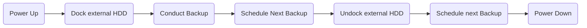

# Backup Server (BaSe)

Your Home NAS requires you to make backups from time to time. Since you have better things to do, these will likely get forgotten or done irregulary. The Backup-Server aims on helping you out. It backs up your data on schedule and undocks the backup medium when the backup is done. This offers an unique way of data protection.

## Introduction (longer)

Like many other people (*cough* nerds) I have a home NAS that serves nextcloud and some other funny stuff. Thanks to a terrific community it became quite easy to setup such a thing. Many, many thanks to you all!
However, hosting my own server came with a serious disadvantage. I had to take care of the backups myself.

I built Backup Server to overcome this issue. It sleeps and therefore consumes very, very little current most of the times, wakes up when a backup is scheduled, docks to a hard drive, copys all the data from the nas, undocks and goes back to sleep.


## Implementation

The current verion is built around a banana pi mk1. It connects to the hard drive via a motor-driven pluggable sata-connection, which is the core of the whole thing. This way, the harddrive is only connected to anything if needed.



# Components

the next hardware version shall be more flexible compared to our custom fit to the banana pi.
# base-pcu

This has the directories

- ChibiOS
- ChibiOS-Contrib

as submodules.

```shell
git submodule add git@github.com:ChibiOS/ChibiOS.git
git submodule add git@github.com:ChibiOS/ChibiOS-Contrib.git
```

open `os/various/shell/shell.h` and change line 57

```c
#define SHELL_MAX_ARGUMENTS         10  // originally 4
```
